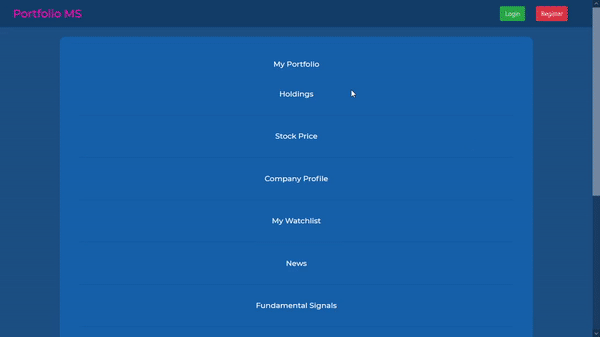
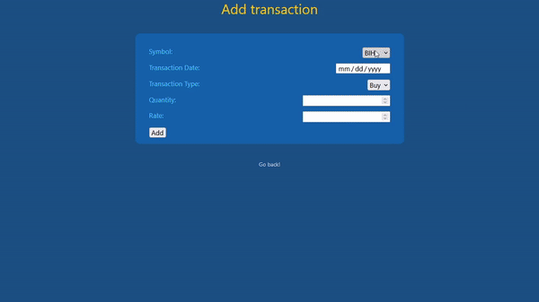

# A Database Management System(DBMS) project on stock market portfolio management system which also consists of scrip suggestion by analyzing fundamental and technical signals. 
Technologies used currently: 
Flask, HTML, CSS, Bootstrap, JavaScript, MySQL

# Demo:

